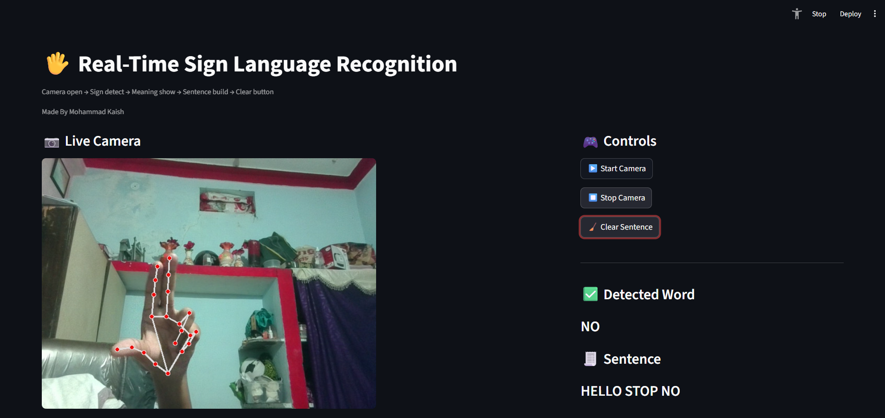
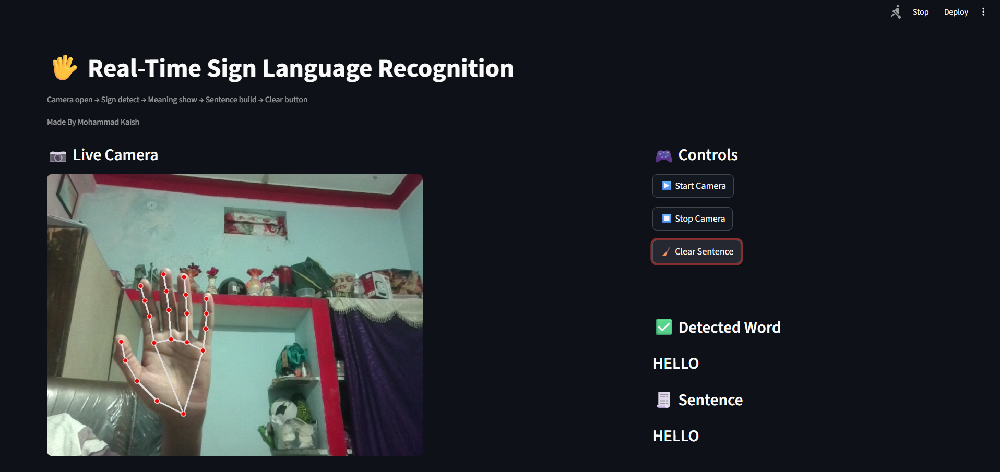

# 🤟 Real-Time Sign Language Recognition System

🚀 A real-time computer vision application that detects hand gestures and converts them into meaningful words and sentences using Machine Learning.

---

## 🧠 Project Highlights

* 🔥 Real-time gesture detection (15–20 FPS)
* 🧠 ML model achieving **90–92% accuracy**
* 🛠️ Custom dataset pipeline with **63 landmark features**
* 💬 Sentence generation from continuous predictions
* ⚡ Prediction smoothing using buffer (deque)
* 🎯 End-to-end ML pipeline (data → model → deployment)

---

## 📌 Problem Statement

Communication barriers exist for deaf and mute individuals in real-time interactions.
This project enables gesture-based communication by translating hand signs into readable text.

---

## ⚙️ How It Works

1. 📷 Capture hand gestures via webcam
2. 🧠 Extract 63 hand landmark features using MediaPipe
3. 🤖 Predict gesture using trained ML model
4. 🔁 Smooth predictions using buffer logic
5. 💬 Convert predictions into words and sentences

---

## 🛠️ Tech Stack

* Python
* OpenCV
* MediaPipe
* Scikit-learn
* Streamlit

---

## 📸 Demo





---

## 🚀 Installation & Usage

```bash
git clone https://github.com/mohammad-kaish03/RealTimeSignLanguage-System.git
cd RealTimeSignLanguage-System

pip install -r requirements.txt
streamlit run app.py
```

---
## 🌐 Live Demo
[Try the App](https://realtimesignlanguage.streamlit.app/)

## 📂 Project Structure

```
RealTimeSignLanguage-System/
│── app.py
│── config.py
│── data_collection.py
│── train_model.py
│── requirements.txt
│── README.md
│
│── data/
│── models/
│── images/
```

---

## 📈 Future Improvements

* Add more gesture classes
* Improve model robustness
* Deploy as web/mobile application

---

## 👨‍💻 Author

**Mohammad Kaish Ansari**
📧 [mohammadkaish8349@gmail.com](mailto:mohammadkaish8349@gmail.com)
